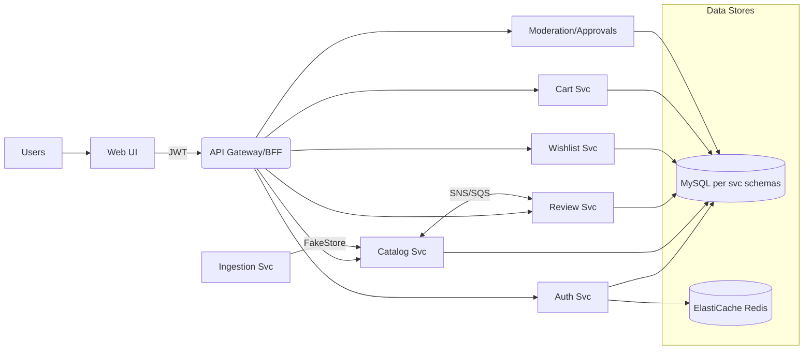
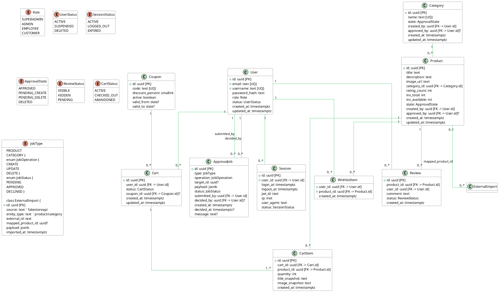

# Arquitectura

## General
- .NET service deployed on AWS (ECS Fargate).
- `SHA` versioned docker images.
- Pipelines GitHub Actions for CI/CD.

## Decisiones clave
- Look for `docs/decisions/` for decision making process (why ECS, why GHCR/ECR, etc.).

## System Overview

Mermaid at-a-glance:

Key components: React/Next UI, ASP.NET Core APIs, ECS Fargate services, MySQL, ElastiCache Redis, SNS/SQS, API Gateway/ALB, CloudWatch/X-Ray.

---

## Architecture & Components

### Services & Repos

| Component              | Purpose                                                  | Tech          | Deployable |
| ---------------------- | -------------------------------------------------------- | ------------- | ---------- |      |
| API Gateway/BFF        | Route aggregation & authz                                | ASP.NET Core  | Yes        |
| **Auth Service**       | `/api/auth`,`/api/login`,`/api/logout`,`/api/admin/auth` | .NET 8        | Yes        |
| **Catalog Service**    | Products/Categories CRUD, list/detail                    | .NET 8        | Yes        |
| **Review Service**     | Product reviews (list/add)                               | .NET 8        | Yes        |
| **Wishlist Service**   | Wishlist CRUD                                            | .NET 8        | Yes        |
| **Cart Service**       | Cart preview, totals, coupons                            | .NET 8        | Yes        |
| **Moderation Service** | Approval jobs queue and actions                          | .NET 8        | Yes        |
| **Ingestion Service**  | FakeStore seeding/sync                                   | .NET 8 Worker | Yes        |

**Runtime (AWS):** API Gateway (HTTP API) → ALB → ECS Fargate; ECR images; MySQL; ElastiCache Redis; SNS/SQS; EventBridge schedules; Secrets Manager; CloudWatch/X-Ray.

### Data Model (logical)

**Entities**: User, Session, Category, Product, Review, WishlistItem, Cart, CartItem, Coupon, ApprovalJob, ExternalImport.
**Highlights**: Unique `email`/`username`; product `rating_rate` + `rating_count`; inventory (`inv_total`, `inv_available`); approval states (`APPROVED`,`PENDING_CREATE`,`PENDING_DELETE`,`DELETED`); one active cart per user enforced in logic.

**ER (PlantUML)**

### Integrations & Dependencies

* **Inbound:** FakeStore API (seed/refresh Products & Categories) via Ingestion Service (EventBridge schedule).
* **Outbound:** Email/Slack webhooks for CI/CD & deployment notifications.
* **Secrets:** AWS Secrets Manager & SSM Parameter Store. No secrets committed.

---