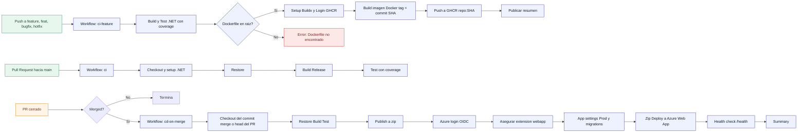
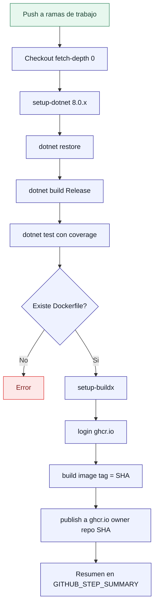
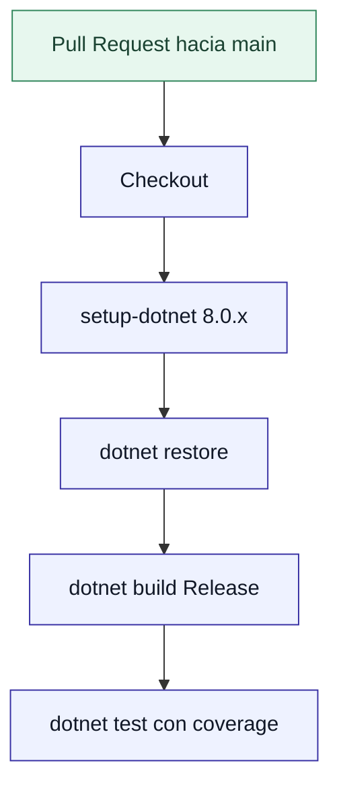
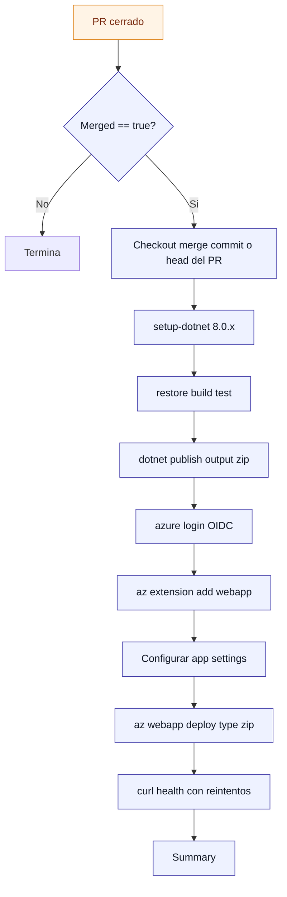
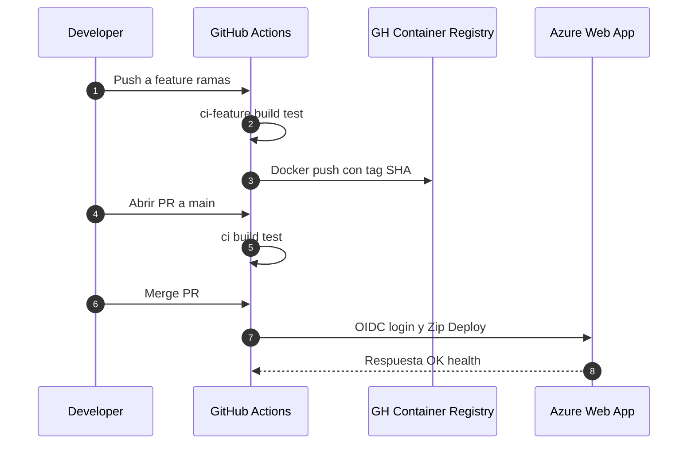

# Workflows CI/CD 

---

## 1) Vista general (end-to-end)

---

## 2) Detalle: ci-feature (ramas de feature/hotfix/bugfix)

---

## 3) Detalle: ci (PR hacia main)

---

## 4) Detalle: cd-on-merge (deploy a Azure tras merge)

---

## 5) Secuencia (actores y artefactos)

