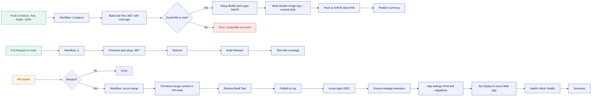
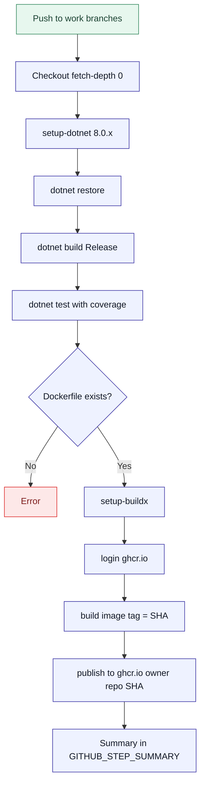
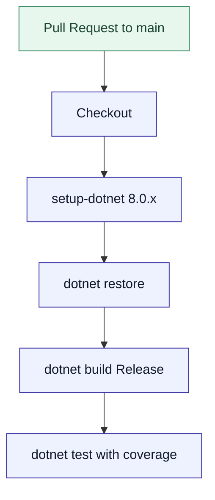
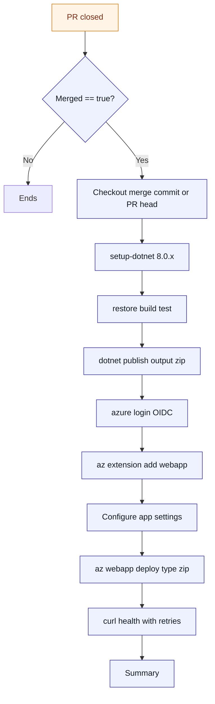

# CI/CD Workflows 


---

## 1) General Overview (end-to-end)



---

## 2) Detail: ci-feature (feature/hotfix/bugfix branches)



---

## 3) Detail: ci (PR to main)



---

## 4) Detail: cd-on-merge (deploy to Azure after merge)



---

## 5) Sequence (actors and artifacts)

```mermaid
sequenceDiagram
  autonumber
  participant Dev as Developer
  participant GA as GitHub Actions
  participant GHCR as GH Container Registry
  participant Azure as Azure Web App

  Dev->>GA: Push to feature branches
  GA->>GA: ci-feature build test
  GA->>GHCR: Docker push with SHA tag

  Dev->>GA: Open PR to main
  GA->>GA: ci build test

  Dev->>GA: Merge PR
  GA->>Azure: OIDC login and Zip Deploy
  Azure-->>GA: OK health response
